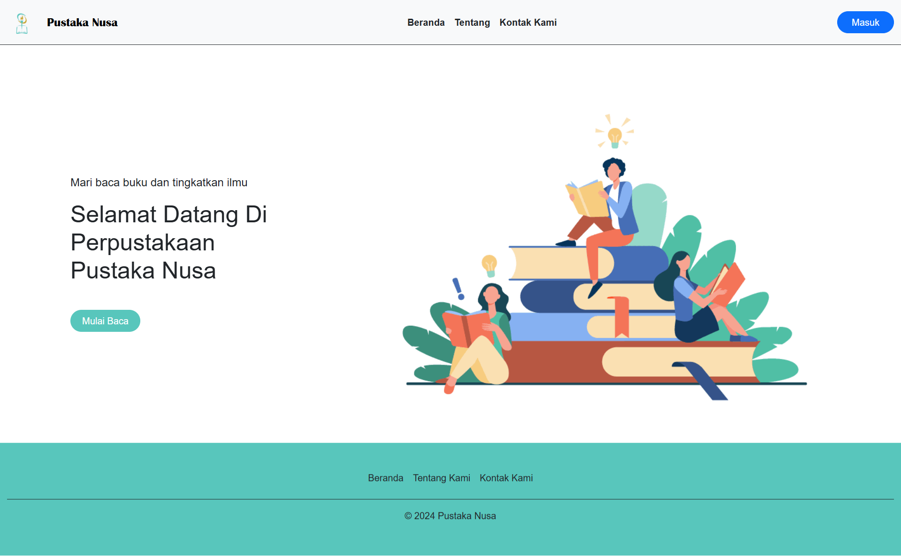
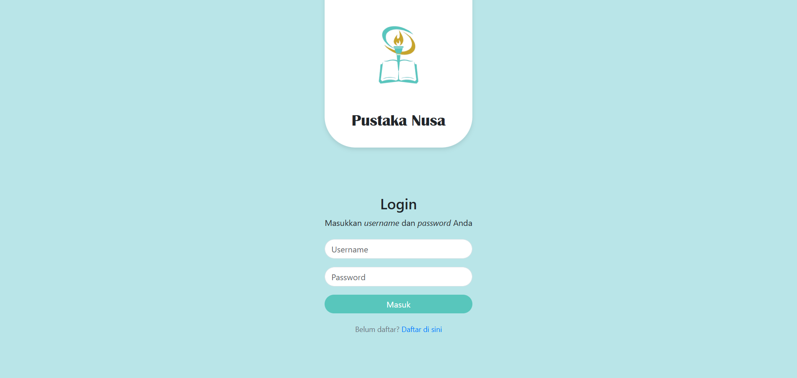
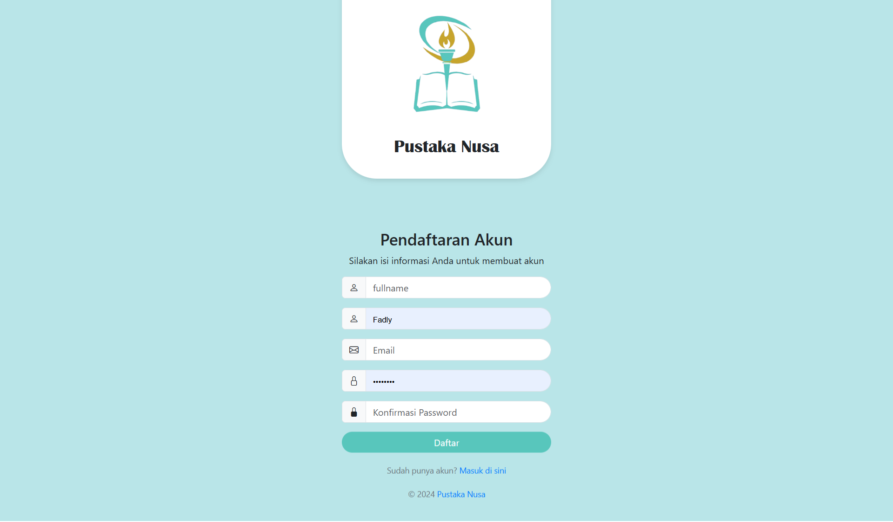
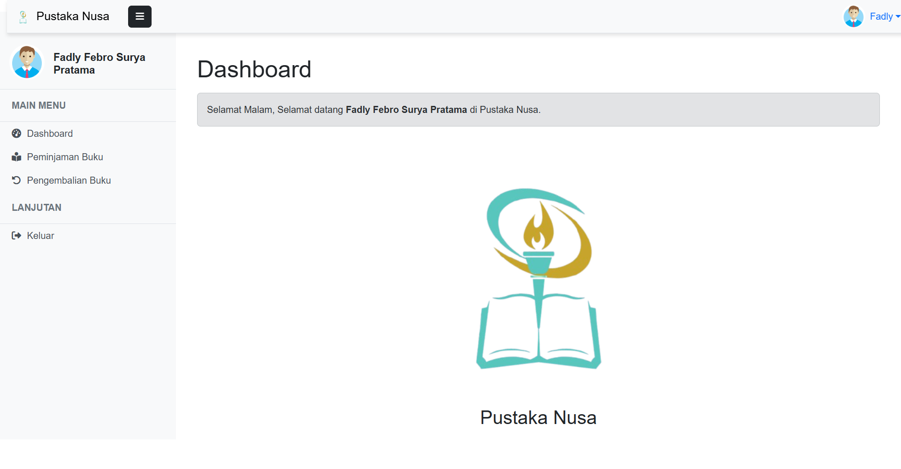

## Daftar Isi
1. [Pendahuluan](#pendahuluan)
2. [Fitur](#fitur)
3. [Persyaratan](#persyaratan)
4. [Instalasi](#instalasi)
5. [Hasil Project](#hasil-project)

---

## Pendahuluan

Proyek ini adalah tugas Project akhir semester 3 dengan tema Perpustakaan yang dikembangkan oleh:
1. Fadly Febro  
2. Robi Moreno  
3. Azzahri Alfiansyah  
4. Abdiel Rafif Elfairuz  

### Proyek ini bertujuan untuk memberikan contoh implementasi sistem perpustakaan yang mencakup pengelolaan data anggota, buku, dan peminjaman, dengan fitur autentikasi dan role-based access.
Project Kami Menggunakan Laravel dan Bootstrap:

<div style="display: flex; justify-content: space-evenly; align-items: center; gap: 20px; margin-top: 20px;">
  <a href="https://laravel.com" target="_blank">
    
  </a>
  <a href="https://getbootstrap.com/" target="_blank">
    
  </a>
</div>

---

## Fitur

Proyek ini memiliki dua role dengan fitur berikut:

### Role Admin:
- **Data Anggota**: Kelola informasi anggota perpustakaan.  
- **Data Penerbit**: Kelola informasi penerbit buku.  
- **Data Administrator**: Kelola pengguna dengan hak akses admin.  
- **Data Peminjaman**: Kelola transaksi peminjaman buku.  
- **Kategori**: Kelola kategori buku.  
- **Data Buku**: Kelola koleksi buku di perpustakaan.  

### Role Anggota:
- **Peminjaman Buku**: Fasilitas peminjaman buku oleh anggota.  
- **Pengembalian Buku**: Fasilitas untuk pengembalian buku yang telah dipinjam.  

---

## Persyaratan

Untuk menjalankan proyek ini, Anda memerlukan:
- **XAMPP**: Untuk server lokal dan database MySQL.  
- **Composer**: Untuk mengelola dependensi PHP.  
- **Git**: Untuk meng-clone repository dari GitHub.  

---

## Instalasi

Ikuti langkah-langkah berikut untuk menjalankan proyek ini di komputer Anda:

1. **Clone repository:**
   ```bash
   git clone <repository-url>
   cd <nama-folder-repository>
   ```

2. **Install dependencies menggunakan Composer:**
   ```bash
   composer install
   ```

3. **Salin file `.env.example` menjadi `.env`:**
   ```bash
   cp .env.example .env
   ```

4. **Generate application key:**
   ```bash
   php artisan key:generate
   ```

5. **Update dependencies dengan Composer (opsional, jika diperlukan):**
   ```bash
   composer update
   ```

6. **Konfigurasi file `.env`:**
   Edit bagian berikut:
   ```
   DB_CONNECTION=mysql
   DB_HOST=127.0.0.1
   DB_PORT=3306
   DB_DATABASE=pustakanusa
   DB_USERNAME=root
   DB_PASSWORD=
   ```

7. **Tambahkan database di phpMyAdmin:**
   - Masuk ke phpMyAdmin.
   - Buat database baru dengan nama `pustakanusa`.

8. **Jalankan migration untuk membuat tabel di database:**
   ```bash
   php artisan migrate
   ```

9. **Jalankan server Laravel:**
   ```bash
   php artisan serve
   ```

10. **Akses aplikasi di browser:**
    Buka URL berikut di browser Anda:  
    [http://127.0.0.1:8000](http://127.0.0.1:8000)

---

## Hasil Project

Berikut adalah beberapa tampilan dari hasil project:

  
  
  

