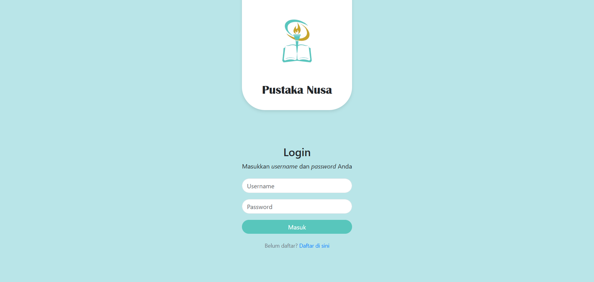
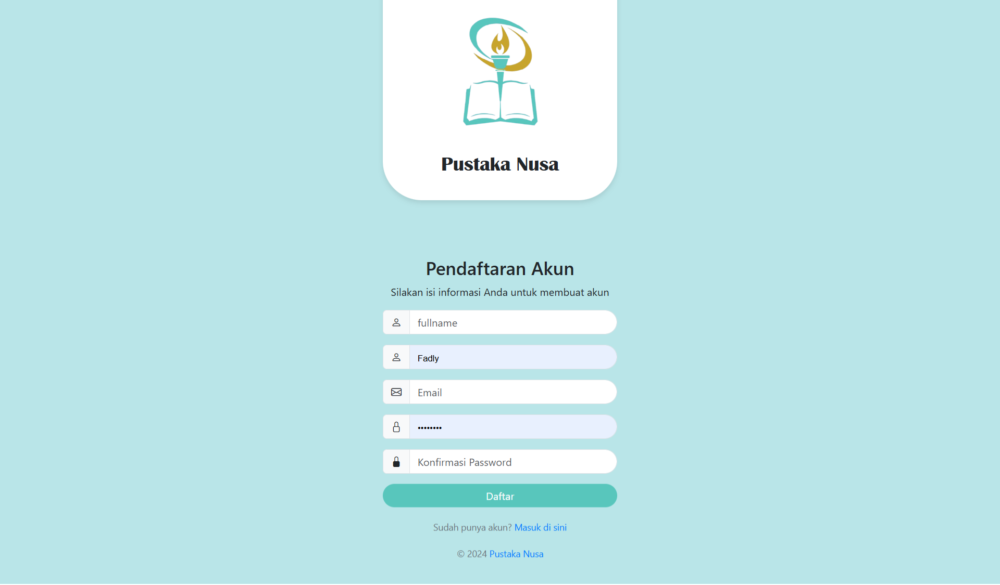
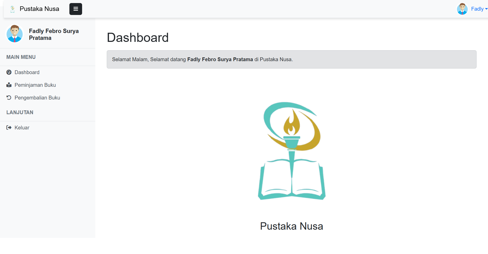

## Hasil Project

Berikut adalah beberapa tampilan dari hasil project:






---

# Panduan Clone Laravel dari GitHub

## Langkah-Langkah Clone Laravel

1. **Clone repository:**
   ```bash
   git clone <repository-url>
   cd <nama-folder-repository>
   ```

2. **Install dependencies menggunakan Composer:**
   ```bash
   composer install
   ```

3. **Salin file `.env.example` menjadi `.env`:**
   ```bash
   cp .env.example .env
   ```

4. **Generate application key:**
   ```bash
   php artisan key:generate
   ```

5. **Update dependencies dengan Composer (opsional, jika diperlukan):**
   ```bash
   composer update
   ```

6. **Konfigurasi file `.env`:**
   Pada bagian berikut:
   ```env
   DB_CONNECTION=sqlite
   DB_HOST=127.0.0.1
   DB_PORT=3306
   DB_DATABASE=laravel
   DB_USERNAME=root
   DB_PASSWORD=
   ```

   Ubah menjadi:
   ```env
   DB_CONNECTION=mysql
   DB_HOST=127.0.0.1
   DB_PORT=3306
   DB_DATABASE=pustakanusa
   DB_USERNAME=root
   DB_PASSWORD=
   ```

7. **Jalankan server Laravel:**
   ```bash
   php artisan serve
   ```

8. **Akses aplikasi di browser:**
   Buka browser dan akses URL berikut:
   ```
   http://127.0.0.1:8000
   ```
